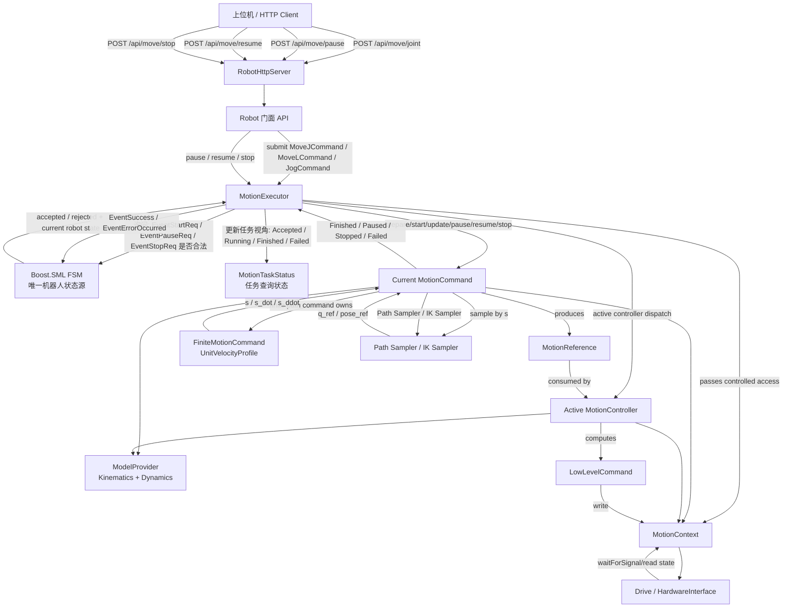

# Motion FSM, Executor, Command 技术设计

本文档整理机器人运动状态机与底层运动控制的解耦设计。目标是让 FSM 只负责状态流转，让 MoveJ、MoveL、点动等运动实现只负责运动参考生成，让 MotionController 决定如何控制和下发，整体由 MotionExecutor 统一调度。

**运动中失败先由 Command 报告失败类型，Executor 根据失败类型决定“安全停止回 STOPPED”还是“进入 ERROR_STATE”；FSM 只表达最终机器人状态，任务失败原因保存在 MotionTaskStatus/last_error 里。**

## 背景

当前 `Robot::MoveJ`、`Robot::MoveL`、点动、拖拽示教等接口直接调用 `enterRunning()` 和 `enterStopped()`。这种方式能工作，但运动函数会直接参与状态机流转，导致两个问题：

- 状态机知道的业务动作越来越多，后续 Pause、Resume、Stop、Servo、Identify 会继续增加耦合。
- 运动生命周期逻辑散落在不同函数里，容易出现失败路径没有释放 RUNNING、暂停继续语义不一致等问题。

新的设计希望形成如下边界：

```text
HTTP/API 层
  -> Robot 门面
  -> MotionExecutor
  -> FSM
  -> MotionCommand
  -> MotionReference
  -> MotionController
  -> LowLevelCommand
  -> FiniteMotionCommand(UnitVelocityProfile) / 底层控制循环
```

说明：`UnitVelocityProfile` 提供 Start、Pause、Resume、Stop、Update 等能力，适合作为有限路径运动的单位进度控制器。本文档建议不要把它放在最顶层 `MotionCommand`，而是放在 `FiniteMotionCommand` 基类中。MoveJ、MoveL、MoveC、StepJog 等有限路径命令继承 `FiniteMotionCommand`；连续点动 `JogCommand` 单独实现 `update()`，不携带有限路径 profile。这样既复用 profile，又不会让所有 command 都背上有限路径语义。

## 核心角色

### FSM

FSM 只管理机器人运动生命周期，不关心具体运动类型。

主要状态：

```text
STOPPED
STARTING
RUNNING
PAUSING
PAUSED
CONTINUING
STOPPING
ERROR_STATE
```

典型事件：

```text
EventStartReq
EventSuccess
EventPauseReq
EventContinueReq
EventStopReq
EventErrorOccurred
```

FSM 不应该知道 `MoveJ`、`MoveL`、`MoveC`、`Jog` 等具体名称。

## 逻辑框图



这张图表达三个关键隔离点：

- FSM 只接收事件，不调用 MoveJ/MoveL 细节。
- MotionExecutor 只调度当前 command，并使用 FSM 判断动作是否合法。
- MotionTaskStatus 只是任务查询状态，不替代 FSM 的机器人状态。
- `UnitVelocityProfile` 属于 `FiniteMotionCommand` 基类；有限路径命令复用它，连续命令不携带它。
- MotionCommand 生成 `MotionReference`，不直接下发关节目标。
- MotionController 消费 `MotionReference`，结合模型和实际状态生成 `LowLevelCommand`。
- MotionContext 负责实际状态读取和底层命令下发，不让 command/controller 直接拥有完整 `Robot` 控制权。

### MotionExecutor

MotionExecutor 是运动任务调度器，每个 `Robot` 建议持有一个 executor。

职责：

- 接收 `MotionCommand`。
- 检查当前是否已有运动任务。
- 请求 FSM 进入 STARTING/RUNNING。
- 启动运动线程或控制循环。
- 处理 pause、resume、stop。
- 接收 command 的 finished、failed、stopped 回报。
- 统一释放当前任务，并通知 FSM 回到 STOPPED 或进入 ERROR_STATE。

MotionExecutor 知道“当前有一个任务”，但不关心任务是 MoveJ 还是 MoveL。

FSM 是唯一的机器人运动状态源。MotionExecutor 不维护 `STOPPED/RUNNING/PAUSED` 这类机器人状态，避免出现两个状态源互相矛盾。Executor 只维护任务管理数据，例如当前 command、task id、任务查询状态、worker 线程状态和最后一次错误。

建议把 MotionExecutor 设计成“运动生命周期所有权”的唯一持有者：

```text
MotionExecutor
  owns current command
  references active MotionController owned by Robot
  owns/uses motion worker thread
  owns current task id / task state
  owns stop/pause/resume request coordination
  references FSM gateway
  references MotionContext
  references ModelProvider
```

它内部可以维护如下任务状态和结果码：

```cpp
enum class MotionResultCode {
    Ok,
    Busy,
    InvalidCommand,
    InvalidState,
    Unsupported,
    PlanningFailed,
    ExecutionFailed,
    HardwareFault
};

enum class MotionTaskStatus {
    None,
    Accepted,
    Running,
    Paused,
    Stopping,
    Finished,
    Failed,
    Cancelled
};

enum class MotionStepStatus {
    Running,
    Paused,
    Finished,
    Stopped,
    Failed
};
```

`MotionTaskStatus` 只服务于 HTTP task 查询和 executor 清理逻辑，不参与机器人状态流转判断。判断“当前能不能 start/pause/resume/stop”必须问 FSM，而不是看 `MotionTaskStatus`。

例子：

```text
FSM = STOPPED, task_status = Finished
  -> 合法：机器人已停止，上一条任务完成。

FSM = ERROR_STATE, task_status = Failed
  -> 合法：机器人处于错误态，上一条任务失败。

FSM = RUNNING, task_status = Running
  -> 合法：当前任务正在占用机器人。
```

建议公开接口：

```cpp
class MotionExecutor {
public:
    MotionSubmitResult submit(std::unique_ptr<MotionCommand> command);

    MotionResult pause();
    MotionResult resume();
    MotionResult stop();

    MotionTaskStatus currentTaskStatus() const;
    std::string currentRobotState() const;
    bool hasActiveCommand() const;

private:
    void workerLoop();
    void finishCurrentCommand(MotionStepStatus status);
    MotionResult notifyStartAccepted();
    MotionResult notifyStopCompleted();
    MotionResult notifyError(MotionResultCode reason);
};
```

`submit()` 的责任边界：

```text
submit(command)
  -> command 非空检查
  -> current command 是否为空
  -> FSM 是否允许 EventStartReq
  -> command.prepare(ctx, model)
  -> command.start(ctx)
  -> 启动 workerLoop
  -> 返回 task_id 或错误
```

`pause()` 的责任边界：

```text
pause()
  -> 当前必须有 command
  -> 当前 command 必须 supportsPause()
  -> FSM 必须接受 EventPauseReq
  -> 调用 command.pause(ctx)
  -> workerLoop 继续 update，直到 command 返回 Paused
  -> FSM 接收 EventSuccess，进入 PAUSED
```

`resume()` 的责任边界：

```text
resume()
  -> 当前必须有 command
  -> 当前 command 必须 supportsResume()
  -> FSM 必须接受 EventContinueReq
  -> 调用 command.resume(ctx)
  -> FSM 接收 EventSuccess，进入 RUNNING
  -> workerLoop 继续 update
```

`stop()` 的责任边界：

```text
stop()
  -> 如果没有 command，可作为幂等 no-op
  -> 当前 command 必须 supportsStop()
  -> FSM 必须接受 EventStopReq
  -> 调用 command.stop(ctx)
  -> workerLoop 继续 update，直到 command 返回 Stopped
  -> 清理 command，FSM 进入 STOPPED
```

并发要求：

- `submit/pause/resume/stop` 可能来自 HTTP 线程。
- `workerLoop` 在运动线程或实时控制循环中运行。
- executor 对 `current_command_`、`task_status_`、请求标志必须加锁或使用原子状态。
- 不建议在持有 executor mutex 时调用可能阻塞的底层硬件函数。
- FSM 的 `process_event()` 已有递归锁保护，但 executor 仍应把自身状态保护好。

建议成员：

```cpp
class MotionExecutor {
private:
    mutable std::mutex mutex_;
    std::unique_ptr<MotionCommand> current_;
    MotionController* active_controller_{nullptr};  // owned by Robot
    MotionContext& ctx_;
    ModelProvider& model_;
    RobotFsmGateway& fsm_;
    std::unique_ptr<std::thread> worker_;
    std::atomic<bool> worker_running_{false};
    std::string current_task_id_;
    MotionTaskStatus task_status_;
    MotionResultCode last_result_{MotionResultCode::Ok};
    std::string last_error_message_;
};
```

`RobotFsmGateway` 可以是对现有 `Robot::Impl::process_event()` 的薄包装，避免 executor 直接依赖 Boost.SML 类型。

### Robot 指针与所有权边界

`Robot*` 不应在 `MotionExecutor`、`MoveJCommand`、`MoveLCommand`、`MotionController` 中到处传播。推荐的所有权和指针规则：

```text
Robot
  owns RobotMotionContext
  owns RobotModelProvider
  owns RobotFsmGateway
  owns MotionExecutor
  owns controller registry / active MotionController

MotionExecutor
  holds MotionContext&
  holds ModelProvider&
  holds RobotFsmGateway&
  holds MotionController* or MotionController&  // controller owned by Robot
  owns current MotionCommand

MotionCommand
  no Robot*
  reads snapshots in prepare(ctx, model)

MotionController
  no Robot*
  reads state through MotionContext
  reads model through ModelProvider
```

也就是说，`Robot` 指针只放在适配层：

```text
RobotMotionContext
RobotModelProvider
RobotFsmGateway
```

`MoveJCommand` 需要当前关节角、当前速度、当前末端姿态时，不保存 `Robot*`，而是在 `prepare(ctx, model)` 中读取快照：

```text
MoveJCommand::prepare(ctx, model)
  -> q_start = ctx.jointPositions()
  -> q_dot_start = ctx.jointVelocities()
  -> flange_start = ctx.flangePose()
  -> q_goal = user target
  -> check limits / modes / profile limits
```

控制器切换由 `Robot` 管理，executor 只使用当前激活控制器：

```text
Robot::setController(type)
  -> require FSM state is IDLE or STOPPED
  -> create/select controller owned by Robot
  -> executor.setActiveController(controller_ptr)
```

### ModelProvider

`ModelProvider` 是只读模型服务，供 `MotionCommand` 和 `MotionController` 共同使用。它不直接读写硬件，也不管理状态机。

```cpp
class ModelProvider {
public:
    KinematicsAdapter& kinematics();
    DynamicsAdapter& dynamics();
};
```

建议职责：

```text
KinematicsAdapter
  -> FK
  -> IK
  -> Jacobian
  -> singularity / reachability check

DynamicsAdapter
  -> M(q)
  -> C(q, q_dot)
  -> G(q)
  -> Lambda(q)
  -> torque feasibility / feedforward terms
```

`MotionCommand` 主要使用运动学模型做路径采样、IK、FK、奇异性检查和路径预览。`MotionController` 会同时使用运动学和动力学模型做前馈计算、阻抗成型、雅可比映射、重力补偿和力矩约束检查。

### MotionReference 与 LowLevelCommand

`MotionReference` 是 command 到 controller 的中间数据。它表示“希望机器人跟踪什么参考”，不是底层下发命令。

```cpp
enum class ReferenceSpace : uint8_t {
    None = 0,
    Joint = 1,
    Cartesian = 2,
    Both = 3
};

struct JointReference {
    KDL::JntArray q;
    KDL::JntArray q_dot;
    KDL::JntArray q_ddot;
};

struct CartesianReference {
    KDL::Frame pose;
    KDL::Twist twist;
    KDL::Twist acceleration;
};

struct MotionReference {
    ReferenceSpace space{ReferenceSpace::None};
    std::optional<JointReference> joint;
    std::optional<CartesianReference> cartesian;
};
```

`LowLevelCommand` 是 controller 到 hardware/context 的输出，表示“本周期最终下发什么”。

```cpp
struct LowLevelCommand {
    std::optional<KDL::JntArray> target_position;
    std::optional<KDL::JntArray> target_velocity;
    std::optional<KDL::JntArray> target_torque;
};
```

核心边界：

```text
MotionCommand
  -> 生成 MotionReference

MotionController
  -> 消费 MotionReference
  -> 生成 LowLevelCommand

MotionContext
  -> 下发 LowLevelCommand
```

### MotionController

`MotionController` 是控制律和下发策略的抽象。代码上建议使用基类 + 子类，`Robot` 或 `MotionExecutor` 支持切换当前控制器类型。

```cpp
enum class ControllerType {
    Position,
    JointImpedance,
    JointAdmittance,
    CartesianImpedance,
    CartesianAdmittance
};

enum class ComplianceSpace {
    None,
    Joint,
    Cartesian
};

class MotionController {
public:
    virtual ~MotionController() = default;

    virtual ControllerType type() const = 0;
    virtual ReferenceSpace acceptedReferenceSpace() const = 0;
    virtual ComplianceSpace complianceSpace() const = 0;

    virtual MotionResult activate(MotionContext& ctx,
                                  ModelProvider& model) = 0;

    virtual MotionStepResult update(MotionContext& ctx,
                                    ModelProvider& model,
                                    const MotionReference& ref,
                                    LowLevelCommand& out) = 0;

    virtual MotionResult deactivate(MotionContext& ctx) = 0;
};
```

典型子类：

```text
PositionController              位置控制器
JointImpedanceController        基于关节扭矩的阻抗控制器
JointAdmittanceController       基于关节扭矩的导纳控制器
CartesianImpedanceController    基于关节力矩的笛卡尔阻抗控制器
CartesianAdmittanceController   基于末端六维力的导纳控制器
```

控制器切换约束：

- 只建议在 `IDLE` 或 `STOPPED` 下切换控制器。
- `RUNNING`、`PAUSED`、`PAUSING`、`STOPPING` 中不允许切换。
- `ERROR_STATE` 下是否允许切换，应由 reset 流程统一决定。

`ReferenceSpace` 和 `ComplianceSpace` 是两个不同维度，不能混为一谈：

```text
ReferenceSpace
  -> 轨迹参考在哪个空间表达：Joint / Cartesian / Both

ComplianceSpace
  -> 柔顺或阻抗在哪个空间定义：Joint / Cartesian
```

因此，笛卡尔阻抗控制器不一定只能消费 CartesianReference。它也可以消费 JointReference，并将笛卡尔刚度动态映射到关节空间执行。

例如，当控制器配置了笛卡尔刚度 `K_x` 和阻尼 `D_x`，但收到纯关节参考 `q_d` 时，可以用当前雅可比 `J(q)` 做瞬态映射：

```text
K_q = J(q)^T K_x J(q)
D_q = J(q)^T D_x J(q)

tau = K_q (q_d - q) + D_q (q_dot_d - q_dot) + G(q)
```

这避免了 `MoveJ -> FK -> CartesianReference -> CartesianController 再反算` 的冗余链路。此时 MoveJ 仍然是关节空间轨迹，只是柔顺性由笛卡尔刚度映射决定。

### MotionCommand

MotionCommand 是具体运动任务的抽象。

MotionCommand 的核心思想是：每个具体运动任务都实现同一套生命周期接口。MoveJ、MoveL、Jog 的差异只体现在 command 内部。

建议接口：

```cpp
class MotionCommand {
public:
    virtual ~MotionCommand() = default;

    virtual std::string name() const = 0;

    // 能力声明。Executor 根据这些能力决定是否允许发送 FSM pause/resume 事件。
    virtual bool supportsPause() const { return false; }
    virtual bool supportsResume() const { return false; }
    virtual bool supportsStop() const { return true; }

    // prepare 只做启动前检查和规划准备。失败通常不进入 ERROR_STATE。
    virtual MotionResult prepare(MotionContext& ctx, ModelProvider& model) = 0;

    // start 激活 command 自身资源。
    virtual MotionResult start(MotionContext& ctx) = 0;

    // update 每个控制周期调用一次。返回任务当前进展。
    virtual MotionStepResult update(MotionContext& ctx,
                                    ModelProvider& model,
                                    ReferenceSpace required) = 0;

    // command 声明自己能产生哪类 reference，executor 用它和 controller 能力做匹配。
    virtual ReferenceSpace producedReferenceSpace() const {
        return ReferenceSpace::None;
    }

    // pause/resume/stop 不直接操作 FSM。
    virtual MotionResult pause(MotionContext& ctx) {
        return MotionResult::Unsupported;
    }

    virtual MotionResult resume(MotionContext& ctx) {
        return MotionResult::Unsupported;
    }

    virtual MotionResult stop(MotionContext& ctx) = 0;
};
```

有限路径命令通过 `FiniteMotionCommand` 复用 `UnitVelocityProfile`。这比把 profile 放进最顶层 `MotionCommand` 更清楚：Jog、拖拽示教等连续任务不会被迫携带有限路径状态，也不会降低封装。

```cpp
class FiniteMotionCommand : public MotionCommand {
public:
    bool supportsPause() const override { return true; }
    bool supportsResume() const override { return true; }
    bool supportsStop() const override { return true; }

    MotionResult start(MotionContext& ctx) override {
        profile_.Reset();
        profile_.Start(profileLimits(ctx).max_velocity,
                       profileLimits(ctx).max_acceleration,
                       profileLimits(ctx).max_jerk);
        return MotionResult::Ok;
    }

    MotionResult pause(MotionContext& ctx) override {
        profile_.Pause();
        return MotionResult::Ok;
    }

    MotionResult resume(MotionContext& ctx) override {
        profile_.Resume();
        return MotionResult::Ok;
    }

    MotionResult stop(MotionContext& ctx) override {
        profile_.Stop();
        return MotionResult::Ok;
    }

    MotionStepResult update(MotionContext& ctx,
                            ModelProvider& model,
                            ReferenceSpace required) override;

protected:
    virtual MotionProfileLimits profileLimits(MotionContext& ctx) const = 0;

    virtual MotionSampleResult sample(MotionContext& ctx,
                                      ModelProvider& model,
                                      double s,
                                      double s_dot,
                                      double s_ddot,
                                      ReferenceSpace required) = 0;

    UnitVelocityProfile profile_;
};
```

建议 `MotionStepResult` 携带错误信息：

```cpp
struct MotionStepResult {
    MotionStepStatus status;
    MotionResultCode code;
    std::string message;
    std::optional<MotionReference> reference;
};

struct MotionSampleResult {
    MotionStepStatus status;
    MotionResultCode code;
    std::string message;
    MotionReference reference;

    static MotionSampleResult unsupported(const std::string& message);
};
```

Command 生命周期：

```text
Constructed
  -> prepare(ctx, model)
  -> start(ctx)
  -> if FiniteMotionCommand:
         command.update(ctx, model, required) advances UnitVelocityProfile
         sample(ctx, s, s_dot, s_ddot) repeated
     else:
         update(ctx, model, required) repeated
  -> Finished / Paused / Stopped / Failed
```

有限路径 command 的典型内部结构：

```cpp
class MoveJCommand : public FiniteMotionCommand {
public:
    ReferenceSpace producedReferenceSpace() const override { return ReferenceSpace::Both; }

protected:
    MotionProfileLimits profileLimits(MotionContext& ctx) const override;
    MotionSampleResult sample(MotionContext& ctx,
                              ModelProvider& model,
                              double s,
                              double s_dot,
                              double s_ddot,
                              ReferenceSpace required) override;

private:
    KDL::JntArray q_start_;
    KDL::JntArray q_goal_;
    KDL::JntArray q_cmd_;
};
```

`MoveJCommand::sample()` 的职责：

```text
q_cmd = q_start + s * (q_goal - q_start)
q_dot_cmd = s_dot * (q_goal - q_start)

if required includes Cartesian:
    pose_cmd = FK(q_cmd)

return MotionReference:
    joint = q_cmd / q_dot_cmd / q_ddot_cmd
    cartesian = pose_cmd if requested
```

`MoveLCommand::sample()` 的职责：

```text
pose_cmd = sample Cartesian path by s

if required includes Joint:
    q_cmd = IK(pose_cmd, q_last)

if IK failed during execution: return Failed or request safe stop

return MotionReference:
    cartesian = pose_cmd
    joint = q_cmd if requested
```

有限路径 command 的 pause/resume/stop 和 reachedTarget/stopped/stopCompleted 判断由 `FiniteMotionCommand` 基类统一处理。MoveJ、MoveL、MoveC 只实现 profile limits 和 sample 逻辑，避免重复。

`JogCommand` 的典型内部结构：

```cpp
class JogCommand : public MotionCommand {
public:
    bool supportsPause() const override { return false; }
    bool supportsResume() const override { return false; }
    bool supportsStop() const override { return true; }

private:
    JogDirection direction_;
    double velocity_;
    bool stopping_{false};
};
```

`JogCommand::update()` 的职责：

```text
if not stopping:
    compute next jog target or velocity command
    produce LowLevelCommand directly, or use a jog-specific controller path
    return Running

if stopping:
    ramp velocity down
    if velocity reaches 0: return Stopped
    return Running
```

Command 的禁止事项：

- 不直接调用 FSM `process_event()`。
- 不直接调用 `enterRunning()` / `enterStopped()`。
- 不直接持有完整 `Robot*`，除非处于迁移阶段。
- 不在 `prepare()` 里启动不可回滚的硬件运动。

典型子类：

```text
MoveJCommand
MoveLCommand
MoveCCommand
MovePCommand
JogCommand
AdmittanceTeachCommand
IdentifyCommand
```

### MotionContext

MotionContext 是 executor/controller 访问机器人运行时状态和底层硬件输出的受控上下文，避免 command/controller 到处持有完整 `Robot*`。

可能包含：

```text
joint count
joint current position/velocity
joint mode
joint limits
hardware waitForSignal
write low-level joint command
logger
stop token / cancellation token
```

实现初期可以先用轻量包装，内部仍转发到 `Robot`，后续再逐步收窄权限。

建议 MotionContext 分成只读状态、控制输出、同步等待三类能力。FK、IK、Jacobian、Dynamics 由 `ModelProvider` 提供，不再放在 MotionContext。

```cpp
class MotionContext {
public:
    // 只读状态
    int jointCount() const;
    std::vector<double> jointPositions() const;
    std::vector<double> jointVelocities() const;
    ModeOfOperation jointMode(int id) const;
    bool isEnabled() const;
    KDL::Frame flangePose() const;

    // 限制与配置
    std::vector<double> maxJointVelocity() const;
    std::vector<double> maxJointAcceleration() const;
    std::vector<double> maxJointJerk() const;
    double controlPeriod() const;

    // 控制输出
    void setJointPosition(int id, double position);
    void setJointVelocity(int id, double velocity);
    void setJointTargets(const KDL::JntArray& q);
    void setJointVelocities(const KDL::JntArray& dq);
    void writeLowLevelCommand(const LowLevelCommand& command);

    // 控制同步
    void waitControlCycle();

    // 日志与错误
    Logger::logger_ptr logger();
};
```

MotionContext 的价值：

- 限制 command/controller 能访问的范围，避免它们依赖 `Robot` 的全部内部字段。
- 让 MoveJCommand、MoveLCommand 可以单独测试。
- 后续替换硬件、仿真或离线测试时，只需要替换 context。
- 让 executor 可以统一注入 cancel token、pause token、task id、logger。

迁移阶段可以先这样实现：

```cpp
class RobotMotionContext : public MotionContext {
public:
    explicit RobotMotionContext(Robot& robot);

private:
    Robot& robot_;
};
```

但应把 `RobotMotionContext` 作为唯一持有 `Robot&` 的适配层，command 不直接接触 `Robot&`。

线程安全建议：

- `jointPositions()`、`flangePose()` 等读取应复用现有 `Robot::mtx` 或新增清晰的状态锁。
- `setJointTargets()` / `writeLowLevelCommand()` 应只在运动控制线程调用。
- command 不应直接调用控制输出接口；底层输出应由 controller 生成 `LowLevelCommand` 后通过 context 写入。
- `waitControlCycle()` 应封装 `hw_interface_->waitForSignal(0)`。
- `isEnabled()` 可以作为 command 每周期安全检查，硬件异常由 executor 转成 `ERROR_STATE`。

MotionContext 与现有代码的对应关系：

```text
ctx.jointPositions()
  -> Robot::pos_

ctx.jointMode(id)
  -> joints_[id]->getMode()

ctx.setJointPosition(id, q)
  -> joints_[id]->setPosition(q)

ctx.setJointVelocity(id, dq)
  -> joints_[id]->setVelocity(dq)

ctx.waitControlCycle()
  -> hw_interface_->waitForSignal(0)

model.kinematics().solveIk(...)
  -> kinematics_.CartToJnt(...)

model.kinematics().forward(...)
  -> kinematics_.JntToCart(...)
```

### 是否保留 MotionProgressController

本文档不再单独保留 `MotionProgressController`。原因是它会让 executor 同时管理任务生命周期和有限路径 profile 生命周期，边界容易变厚。更清晰的做法是：

```text
MotionCommand
  -> 顶层命令接口，不携带 UnitVelocityProfile

FiniteMotionCommand : MotionCommand
  -> 有限路径命令基类
  -> 内部持有 UnitVelocityProfile
  -> 统一实现 start/pause/resume/stop/update profile

JogCommand : MotionCommand
  -> 连续点动命令
  -> 不携带 UnitVelocityProfile
  -> 单独实现 update()
```

这样不会降低封装。相反，它把有限路径语义限制在 `FiniteMotionCommand` 分支内，避免让 Jog、拖拽示教、伺服流式命令等连续任务也依赖 `UnitVelocityProfile`。

Executor 不直接操作 `UnitVelocityProfile`，而是调用当前 command 的统一生命周期接口：

```text
submit:
  -> command.start(ctx)

pause:
  -> command.pause(ctx)

resume:
  -> command.resume(ctx)

stop:
  -> command.stop(ctx)

workerLoop:
  -> command.update(ctx, model, active_controller.acceptedReferenceSpace())
```

对于 `FiniteMotionCommand`，`update(ctx, model, required)` 内部推进 `UnitVelocityProfile`，再调用子类实现的 `sample(ctx, model, s, s_dot, s_ddot, required)`。

对于 `JogCommand`，`update(ctx, model, required)` 走连续点动自己的逻辑，通常会忽略 `model/required` 或只使用其中很少一部分。

### UnitVelocityProfile

`UnitVelocityProfile` 是一维单位区间进度规划器。它不表示 MoveJ 或 MoveL，而是表示路径进度 `s`。

```text
s = position()      当前路径进度，范围 0 到 1
s_dot = velocity()  路径进度速度
s_ddot = acceleration()
```

行为：

- `Start()`：从 `s = 0` 规划到 `s = 1`。
- `Pause()`：从当前 `s_dot` 平滑减速到 0，保留当前 `s`。
- `Resume()`：从当前 `s` 继续规划到 `s = 1`。
- `Stop()`：从当前 `s_dot` 平滑减速到 0，并标记 stop completed。
- `Update()`：每个控制周期推进一次。

它适合作为 MoveJ、MoveL、MoveC、StepJog 等有限路径运动的共用底层进度规划器，建议由 `FiniteMotionCommand` 基类持有和封装。

## Sampler 的含义

Sampler 是将 `s` 映射成 `MotionReference` 的组件。它可以是独立类，也可以只是 command 内部函数。Sampler 不直接下发硬件，也不决定使用位置控制、阻抗控制还是力矩控制。

### MoveJ Sampler

MoveJ 在关节空间插值：

```text
q_ref = q_start + s * (q_goal - q_start)
q_dot_ref = s_dot * (q_goal - q_start)
q_ddot_ref = s_ddot * (q_goal - q_start)
```

### CartesianPathSampler

CartesianPathSampler 表示笛卡尔路径采样。

MoveL 示例：

```text
pose_ref.p = p_start + s * (p_goal - p_start)
pose_ref.M = slerp(R_start, R_goal, s)
```

MoveC 示例：

```text
pose_cmd = sample circle arc by s
```

### IKSampler

IKSampler 表示从笛卡尔位姿求关节目标：

```text
q_ref = IK(pose_ref, q_seed)
```

MoveL 可以先实现成一个合并版 `MoveLSampler`，内部同时做笛卡尔采样和 IK：

```text
s -> pose_ref -> q_ref
```

不要求一开始就拆成多个类。

## 轨迹空间与控制器组合场景

MoveJ、MoveL 描述的是路径或参考轨迹类型；Position、JointImpedance、CartesianImpedance 描述的是控制律或柔顺性。两者不应一一绑定。

### MoveJ + PositionController

语义：

```text
关节轨迹 + 关节位置控制
```

运行逻辑：

```text
MoveJCommand.sample()
  -> 生成 JointReference(q_d, q_dot_d, q_ddot_d)

PositionController.update()
  -> 消费 JointReference
  -> LowLevelCommand.target_position = q_d
  -> 可选 target_velocity = q_dot_d

MotionContext.writeLowLevelCommand()
  -> joints[i]->setPosition(...)
```

这是 MoveJ 最直接的执行方式，适合 CSP/CSV 等关节伺服模式。

### MoveJ + JointImpedanceController

语义：

```text
关节轨迹 + 关节刚度
```

运行逻辑：

```text
MoveJCommand.sample()
  -> 生成 JointReference(q_d, q_dot_d, q_ddot_d)

JointImpedanceController.update()
  -> 消费 JointReference
  -> 使用关节刚度 K_q 和阻尼 D_q
  -> tau = K_q (q_d - q) + D_q (q_dot_d - q_dot) + G(q)
  -> LowLevelCommand.target_torque = tau
```

这里轨迹仍然是关节空间路径，只是跟踪方式从刚性位置跟踪变成关节阻抗。

### MoveJ + CartesianImpedanceController

语义：

```text
关节轨迹 + 笛卡尔刚度映射到关节空间
```

不建议为了适配 CartesianImpedanceController 强行执行：

```text
q_d -> FK -> x_d -> Cartesian controller 再反算
```

这会造成资源计算冗余，也会混淆 MoveJ 的语义。更合理的是保持 MoveJ 输出 `JointReference(q_d)`，由 CartesianImpedanceController 将笛卡尔刚度映射成当前构型下的关节空间等效刚度：

```text
J = J(q)
K_q = J^T K_x J
D_q = J^T D_x J

tau = K_q (q_d - q) + D_q (q_dot_d - q_dot) + G(q)
```

此时：

```text
MoveJCommand
  -> 只负责关节轨迹 q_d

CartesianImpedanceController
  -> 使用 K_x / D_x 定义末端柔顺性
  -> 使用 J(q) 动态映射成 K_q / D_q
  -> 输出关节力矩或等效关节命令
```

这体现了“轨迹空间”和“柔顺空间”的解耦：路径是关节空间，柔顺性可以按笛卡尔空间定义。

### MoveL + PositionController

语义：

```text
笛卡尔路径采样 + IK 得到 q_d + 关节位置控制
```

运行逻辑：

```text
MoveLCommand.sample()
  -> 根据 s 采样 pose_d
  -> IK(pose_d, q_seed) 得到 q_d
  -> 生成 JointReference(q_d) 和可选 CartesianReference(pose_d)

PositionController.update()
  -> 消费 JointReference
  -> LowLevelCommand.target_position = q_d
```

这是最接近当前实现的 MoveL 路径：MoveL 保证末端路径，控制器仍然用关节位置模式执行。

### MoveL + JointImpedanceController

语义：

```text
笛卡尔路径采样 + IK 得到 q_d + 关节阻抗控制
```

运行逻辑：

```text
MoveLCommand.sample()
  -> 根据 s 采样 pose_d
  -> IK(pose_d, q_seed) 得到 q_d
  -> 生成 JointReference(q_d, q_dot_d, q_ddot_d) 和可选 CartesianReference(pose_d)

JointImpedanceController.update()
  -> 消费 JointReference
  -> 使用关节刚度 K_q 和阻尼 D_q
  -> tau = K_q (q_d - q) + D_q (q_dot_d - q_dot) + G(q)
  -> LowLevelCommand.target_torque = tau
```

这说明 MoveL 不等于必须使用笛卡尔控制器。MoveL 描述末端路径，执行方式可以仍然是关节阻抗，只要 command 提供可消费的 `JointReference`。

### MoveL + CartesianImpedanceController

语义：

```text
笛卡尔路径 pose_d + 笛卡尔阻抗控制
```

运行逻辑：

```text
MoveLCommand.sample()
  -> 根据 s 采样 pose_d / twist_d
  -> 生成 CartesianReference(pose_d, twist_d)

CartesianImpedanceController.update()
  -> 消费 CartesianReference
  -> 计算当前 x = FK(q), x_dot = J(q) q_dot
  -> F = K_x (x_d - x) + D_x (x_dot_d - x_dot)
  -> tau = J(q)^T F + G(q)
  -> LowLevelCommand.target_torque = tau
```

这种组合下，MoveL 不需要先 IK 成 q_d；控制器直接在笛卡尔空间闭环跟踪 pose_d。若控制器实现需要关节前馈，也可以由 ModelProvider 提供 IK/Jacobian/Dynamics，但这属于 controller 内部策略。

### 组合规则

Executor 启动任务前应检查 command 和 controller 的能力是否匹配：

```text
command.producedReferenceSpace()
  intersects controller.acceptedReferenceSpace()
```

如果不匹配，任务应在 STARTING 阶段被拒绝并回到 STOPPED，不进入 RUNNING。

## 能力声明

不是所有 command 都支持 pause/resume。

MoveJ、MoveL、MoveC 这类有限路径运动通常支持：

```text
supportsPause() = true
supportsResume() = true
supportsStop() = true
```

连续点动通常只支持 stop：

```text
supportsPause() = false
supportsResume() = false
supportsStop() = true
```

Executor 必须先检查 command 能力，再触发 FSM 事件。

错误示例：

```text
先 RUNNING -> PAUSING，再发现 Jog 不支持 pause
```

正确示例：

```text
pause request
  -> executor checks current_command.supportsPause()
  -> unsupported
  -> 不触发 EventPauseReq
  -> FSM 保持 RUNNING
  -> API 返回当前任务不支持暂停
```

## 统一状态流转

### 提交运动任务

```text
submit(command)
  -> if command is null: return InvalidCommand
  -> if current command exists: return Busy
  -> if FSM cannot process EventStartReq: return InvalidState / Busy
  -> FSM: STOPPED -> STARTING
  -> command.prepare(ctx, model)
  -> if prepare failed: EventStopReq or EventErrorOccurred
  -> check active_controller accepts command.producedReferenceSpace()
  -> command.start(ctx)
  -> active_controller.activate(ctx, model)
  -> if command is FiniteMotionCommand:
         UnitVelocityProfile is started inside command.start(ctx)
  -> FSM: STARTING -> RUNNING
  -> executor control loop starts
```

### 控制周期

```text
while command active:
  step = command.update(ctx, model, active_controller.acceptedReferenceSpace())
  result = step.status

  if step.reference exists and result == Running:
      controller_result = active_controller.update(ctx, model, step.reference, low_level)
      if controller_result.status == Failed:
          result = Failed
      else:
          ctx.writeLowLevelCommand(low_level)

  if step.status == Failed:
      result = Failed

  // 对 FiniteMotionCommand：
  //   update(ctx, model, required) 内部推进 UnitVelocityProfile，
  //   再调用子类 sample(ctx, model, s, s_dot, s_ddot, required)。
  //
  // 对 JogCommand：
  //   update(ctx, model, required) 走自己的连续点动逻辑，不依赖 UnitVelocityProfile。

  if result == Running:
      ctx.waitControlCycle()

  if result == Finished:
      active_controller.deactivate(ctx)
      FSM: RUNNING -> STOPPING -> STOPPED
      clear current command

  if result == Stopped:
      active_controller.deactivate(ctx)
      FSM: STOPPING -> STOPPED
      clear current command

  if result == Failed:
      active_controller.deactivate(ctx)
      FSM: * -> ERROR_STATE
      clear current command
```

### 暂停

```text
pause()
  -> require current command
  -> require current command supports pause
  -> require FSM accepts EventPauseReq
  -> FSM: RUNNING -> PAUSING
  -> command.pause(ctx)
  -> control loop continues updating until command reports Paused
  -> FSM: PAUSING -> PAUSED
```

暂停不是立刻停止线程。控制循环应继续运行，直到底层控制器平滑减速到 0。

### 继续

```text
resume()
  -> require current command
  -> require current command supports resume
  -> require FSM accepts EventContinueReq
  -> FSM: PAUSED -> CONTINUING
  -> command.resume(ctx)
  -> FSM: CONTINUING -> RUNNING
  -> control loop continues updating
```

### 停止

```text
stop()
  -> require current command
  -> require current command supports stop
  -> require FSM accepts EventStopReq
  -> FSM: RUNNING/PAUSED -> STOPPING
  -> command.stop(ctx)
  -> control loop continues updating until command reports Stopped
  -> FSM: STOPPING -> STOPPED
  -> clear current command
```

## 示例运行逻辑

### 场景 1：MoveJ 正常完成

```text
上位机 POST /api/move/joint
  -> RobotHttpServer parses q, speed, acceleration, radius
  -> Robot::MoveJ creates MoveJCommand
  -> MotionExecutor::submit(MoveJCommand)
  -> FSM: STOPPED -> STARTING
  -> MoveJCommand.prepare()
       - check joint count
       - check joint mode
       - check target limits
       - save q_start and q_goal
       - compute profile limits from joint limits
  -> MoveJCommand.start()
       - command resources are ready
       - FiniteMotionCommand starts UnitVelocityProfile internally
  -> FSM: STARTING -> RUNNING
  -> control loop:
       - MoveJCommand.update(ctx)
       - FiniteMotionCommand advances UnitVelocityProfile internally
       - MoveJCommand.sample(ctx, model, s, s_dot, s_ddot, active_controller.acceptedReferenceSpace())
       - produces MotionReference, usually JointReference(q_d)
       - active_controller.update(ctx, model, reference, low_level)
       - ctx.writeLowLevelCommand(low_level)
       - waitForSignal(0)
  -> UnitVelocityProfile reaches target
  -> command reports Finished
  -> FSM: RUNNING -> STOPPING -> STOPPED
  -> task finished
```

### 场景 2：MoveL 正常完成

```text
上位机 POST /api/move/linear
  -> RobotHttpServer parses target pose
  -> Robot::MoveL creates MoveLCommand
  -> MotionExecutor::submit(MoveLCommand)
  -> FSM: STOPPED -> STARTING
  -> MoveLCommand.prepare()
       - check joint mode
       - save current pose as p_start/R_start
       - save target pose as p_goal/R_goal
       - compute path length and rotation angle
       - compute unit interval profile limits
  -> MoveLCommand.start()
       - command resources are ready
       - FiniteMotionCommand starts UnitVelocityProfile internally
  -> FSM: STARTING -> RUNNING
  -> control loop:
       - MoveLCommand.update(ctx)
       - FiniteMotionCommand advances UnitVelocityProfile internally
       - MoveLCommand.sample(ctx, model, s, s_dot, s_ddot, active_controller.acceptedReferenceSpace())
       - produces CartesianReference(pose_d) and/or JointReference(q_d)
       - active_controller.update(ctx, model, reference, low_level)
       - ctx.writeLowLevelCommand(low_level)
       - waitForSignal(0)
  -> UnitVelocityProfile reaches target
  -> FSM: RUNNING -> STOPPING -> STOPPED
  -> task finished
```

### 场景 3：MoveJ 运行中暂停

```text
当前 FSM = RUNNING
current command = MoveJCommand

上位机 POST /api/move/pause
  -> MotionExecutor::pause()
  -> MoveJCommand.supportsPause() == true
  -> FSM: RUNNING -> PAUSING
  -> MoveJCommand.pause(ctx)
       - FiniteMotionCommand calls UnitVelocityProfile.Pause()
  -> control loop continues:
       - MoveJCommand.update(ctx)
       - MoveJCommand.sample(ctx, model, s, s_dot, s_ddot, active_controller.acceptedReferenceSpace())
       - active_controller.update(ctx, model, reference, low_level)
       - ctx.writeLowLevelCommand(low_level)
       - waitForSignal(0)
  -> UnitVelocityProfile velocity reaches 0
  -> command reports Paused
  -> FSM: PAUSING -> PAUSED
```

### 场景 4：MoveJ 暂停后继续

```text
当前 FSM = PAUSED
current command = MoveJCommand
UnitVelocityProfile position = s_pause

上位机 POST /api/move/resume
  -> MotionExecutor::resume()
  -> MoveJCommand.supportsResume() == true
  -> FSM: PAUSED -> CONTINUING
  -> MoveJCommand.resume(ctx)
       - FiniteMotionCommand calls UnitVelocityProfile.Resume()
  -> FSM: CONTINUING -> RUNNING
  -> control loop:
       - MoveJCommand.update(ctx)
       - s 从 s_pause 继续到 1
       - MoveJCommand.sample(ctx, model, s, s_dot, s_ddot, active_controller.acceptedReferenceSpace())
       - active_controller.update(ctx, model, reference, low_level)
       - ctx.writeLowLevelCommand(low_level)
  -> finished
  -> FSM: RUNNING -> STOPPING -> STOPPED
```

### 场景 5：MoveL 运行中暂停并继续

```text
当前 FSM = RUNNING
current command = MoveLCommand

pause:
  -> supportsPause() == true
  -> FSM: RUNNING -> PAUSING
  -> MoveLCommand.pause(ctx)
  -> UnitVelocityProfile.Pause()
  -> control loop keeps sampling reference by current s
  -> active_controller continues consuming MotionReference and writing LowLevelCommand
  -> UnitVelocityProfile velocity reaches 0
  -> FSM: PAUSING -> PAUSED

resume:
  -> supportsResume() == true
  -> FSM: PAUSED -> CONTINUING
  -> MoveLCommand.resume(ctx)
  -> UnitVelocityProfile.Resume()
  -> FSM: CONTINUING -> RUNNING
  -> s continues to 1
  -> MoveLCommand keeps producing MotionReference along same Cartesian path
  -> active_controller continues tracking it
  -> finished
  -> FSM: RUNNING -> STOPPING -> STOPPED
```

### 场景 6：MoveJ 运行中停止

```text
当前 FSM = RUNNING
current command = MoveJCommand

上位机 POST /api/move/stop
  -> MotionExecutor::stop()
  -> MoveJCommand.supportsStop() == true
  -> FSM: RUNNING -> STOPPING
  -> MoveJCommand.stop(ctx)
       - FiniteMotionCommand calls UnitVelocityProfile.Stop()
  -> control loop continues:
       - MoveJCommand.update(ctx)
       - MoveJCommand.sample(ctx, model, s, s_dot, s_ddot, active_controller.acceptedReferenceSpace())
       - active_controller.update(ctx, model, reference, low_level)
       - ctx.writeLowLevelCommand(low_level)
  -> UnitVelocityProfile stop completed
  -> command reports Stopped
  -> FSM: STOPPING -> STOPPED
```

### 场景 7：MoveJ 暂停后停止

```text
当前 FSM = PAUSED
current command = MoveJCommand
UnitVelocityProfile velocity == 0

上位机 POST /api/move/stop
  -> MotionExecutor::stop()
  -> FSM: PAUSED -> STOPPING
  -> MoveJCommand.stop(ctx)
       - because profile velocity is already 0, stop completes immediately
  -> command reports Stopped
  -> FSM: STOPPING -> STOPPED
```

### 场景 8：点动正常启动

连续点动没有固定终点，因此不建议强行使用 `UnitVelocityProfile` 的 `0 -> 1` 模型。

```text
上位机 POST /api/jog/start
  -> Robot creates JogCommand(direction, velocity)
  -> MotionExecutor::submit(JogCommand)
  -> FSM: STOPPED -> STARTING
  -> JogCommand.prepare()
       - check joint mode
       - check velocity limits
       - save jog direction and velocity
  -> JogCommand.start()
  -> JogCommand is not FiniteMotionCommand
  -> FSM: STARTING -> RUNNING
  -> control loop:
       - compute next jog LowLevelCommand or jog-specific reference
       - ctx.writeLowLevelCommand(...)
       - waitForSignal(0)
  -> keeps running until stop request
```

### 场景 9：点动时暂停无效

```text
当前 FSM = RUNNING
current command = JogCommand

上位机 POST /api/move/pause
  -> MotionExecutor::pause()
  -> JogCommand.supportsPause() == false
  -> return Unsupported
  -> FSM remains RUNNING
  -> JogCommand keeps jogging
  -> API returns: current motion type does not support pause
```

关键点：不触发 `EventPauseReq`。

### 场景 10：点动时继续无效

```text
当前 FSM = RUNNING
current command = JogCommand

上位机 POST /api/move/resume
  -> MotionExecutor::resume()
  -> JogCommand.supportsResume() == false
  -> return Unsupported
  -> FSM remains RUNNING
  -> API returns: current motion type does not support resume
```

如果当前不是 PAUSED，resume 本身也应返回 InvalidState。

### 场景 11：点动停止

```text
当前 FSM = RUNNING
current command = JogCommand

上位机 POST /api/move/stop
  -> MotionExecutor::stop()
  -> JogCommand.supportsStop() == true
  -> FSM: RUNNING -> STOPPING
  -> JogCommand.stop()
       - start velocity ramp down
  -> control loop continues until velocity reaches 0
  -> command reports Stopped
  -> FSM: STOPPING -> STOPPED
```

### 场景 12：相对距离点动

如果点动接口是“移动固定相对距离”，例如关节 +0.01 rad，则它本质上是小型有限路径运动，可以让 `StepJogCommand` 继承 `FiniteMotionCommand`。

```text
上位机 POST /api/jog/step
  -> q_goal = q_current + delta
  -> create StepJogCommand
  -> StepJogCommand : FiniteMotionCommand
  -> StepJogCommand.start(ctx)
       - FiniteMotionCommand starts UnitVelocityProfile internally
  -> supportsPause/resume can be true or false, based on product semantics
  -> if treated as finite motion:
       STOPPED -> STARTING -> RUNNING -> STOPPING -> STOPPED
```

### 场景 13：运行中再次提交 MoveJ

```text
当前 FSM = RUNNING
current command = MoveLCommand

上位机 POST /api/move/joint
  -> Robot creates MoveJCommand
  -> MotionExecutor::submit(MoveJCommand)
  -> FSM refuses EventStartReq or executor detects current command exists
  -> return Busy
  -> FSM remains RUNNING
  -> current MoveL continues
```

### 场景 14：规划失败

规划失败通常不应进入 `ERROR_STATE`，因为它是命令参数或路径不可达问题，不是机器人硬件错误。

```text
上位机 POST /api/move/linear
  -> submit MoveLCommand
  -> FSM: STOPPED -> STARTING
  -> MoveLCommand.prepare()
       - IK failed / path invalid / limits invalid
  -> executor treats prepare failed as command rejected
  -> FSM: STARTING -> STOPPING -> STOPPED
  -> clear command
  -> API/task returns planning failed
```

### 场景 15：执行中 IK 失败

执行中 IK 失败比 prepare 阶段更严重，因为机器人已经开始运动。

```text
当前 FSM = RUNNING
current command = MoveLCommand

control loop:
  -> sample pose by s
  -> IK failed
  -> command reports Failed
  -> executor requests safe stop if possible
  -> if safe stop succeeds:
       FSM: RUNNING -> STOPPING -> STOPPED
  -> if unsafe/hardware abnormal:
       FSM: RUNNING -> ERROR_STATE
```

建议实现中区分：

```text
RecoverableFailure: safe stop then STOPPED
FatalFailure: ERROR_STATE
```

### 场景 16：执行中驱动掉使能

```text
当前 FSM = RUNNING

control loop detects !IsEnabled()
  -> command reports Failed or HardwareFault
  -> executor sends EventErrorOccurred
  -> FSM: RUNNING -> ERROR_STATE
  -> require reset / enable before next motion
```

硬件掉使能、急停、通信错误应进入 `ERROR_STATE`。

### 场景 17：暂停期间驱动掉使能

```text
当前 FSM = PAUSED

monitor detects !IsEnabled()
  -> executor sends EventErrorOccurred
  -> FSM: PAUSED -> ERROR_STATE
  -> current command invalidated
```

### 场景 18：无任务时 Stop

```text
当前 FSM = STOPPED
current command = null

上位机 POST /api/move/stop
  -> MotionExecutor::stop()
  -> no active command
  -> return NoActiveCommand or success no-op
  -> FSM remains STOPPED
```

建议 HTTP 层把 stop 设计为幂等操作：无运动时返回 success/no-op。

### 场景 19：无任务时 Pause

```text
当前 FSM = STOPPED
current command = null

上位机 POST /api/move/pause
  -> MotionExecutor::pause()
  -> return NoActiveCommand
  -> FSM remains STOPPED
```

### 场景 20：无任务时 Resume

```text
当前 FSM = STOPPED
current command = null

上位机 POST /api/move/resume
  -> MotionExecutor::resume()
  -> return NoActiveCommand or InvalidState
  -> FSM remains STOPPED
```

### 场景 21：ERROR_STATE 下提交运动

```text
当前 FSM = ERROR_STATE

上位机 POST /api/move/joint
  -> MotionExecutor::submit()
  -> FSM refuses EventStartReq
  -> return InvalidState
  -> require reset/enable first
```

### 场景 22：初始化后未使能提交运动

```text
当前 FSM = IDLE

上位机 POST /api/move/joint
  -> MotionExecutor::submit()
  -> FSM refuses EventStartReq
  -> return NotEnabled / InvalidState
  -> 上位机应先 POST /api/robot/enable
```

### 场景 23：使能成功后提交运动

```text
当前 FSM = IDLE

上位机 POST /api/robot/enable
  -> FSM: IDLE -> ENABLING
  -> Robot setEnabled()
  -> IsEnabled()
  -> FSM: ENABLING -> STOPPED

上位机 POST /api/move/joint
  -> normal submit
```

## API 建议

新增或整理如下控制接口：

```text
POST /api/move/pause
POST /api/move/resume
POST /api/move/stop
GET  /api/move/status?task_id=...
```

返回建议：

```text
0    success
200x planning/execution error
300x robot state error
500x async task error
```

对点动 pause/resume：

```json
{
  "success": false,
  "code": 3004,
  "message": "Current motion type does not support pause"
}
```

## 实现迁移建议

### 阶段 1：建立边界

- 新增 `MotionCommand`、`MotionExecutor`、`MotionContext`。
- 保留现有 `Robot::MoveJ/MoveL` 公开 API。
- 让 `Robot::MoveJ/MoveL` 创建 command 并提交 executor。
- 暂时可以让 command 内部复用现有规划/执行代码。

### 阶段 2：接入 FiniteMotionCommand

- 新增 `FiniteMotionCommand`，内部持有并封装 `UnitVelocityProfile`。
- 让 MoveJ、MoveL、MoveC、StepJog 等有限路径命令继承 `FiniteMotionCommand`。
- 将 MoveJ 改为 `MoveJCommand::profileLimits() + MoveJCommand::sample(s)`。
- 将 MoveL 改为 `MoveLCommand::profileLimits() + MoveLCommand::sample(s)`。
- 暂停/继续/停止由 `FiniteMotionCommand` 调用 `profile_.Pause()/Resume()/Stop()` 完成。
- 连续 Jog 继续直接继承 `MotionCommand`，单独实现 `update()`。

### 阶段 3：点动和拖拽示教 command 化

- 点动使用 `JogCommand`，不支持 pause/resume。
- 拖拽示教使用 `AdmittanceTeachCommand`，按语义决定是否支持 pause/resume。
- 所有运动占用都走 executor，不再直接调用 `enterRunning()/enterStopped()`。

### 阶段 4：收敛状态机事件

- `enterRunning()`、`enterStopped()` 从公开运动函数中移除。
- FSM 事件只由 executor 发出。
- `Robot` 对外仍保留兼容 API。

## 设计原则

- FSM 只管状态，不管轨迹。
- Executor 只管生命周期，不管轨迹细节。
- Command 只管具体运动，不直接改 FSM。
- FiniteMotionCommand 只管有限路径命令的 profile 生命周期，不知道机器人状态机。
- UnitVelocityProfile 是 FiniteMotionCommand 的底层进度实现细节。
- JogCommand 不继承 FiniteMotionCommand，避免连续点动被有限路径 profile 约束。
- Pause/Resume 能力由 command 声明，executor 统一拦截。
- Stop 尽量幂等，并优先平滑停止。
- 参数错误和规划失败默认不进入 `ERROR_STATE`。
- 硬件错误、通信错误、驱动掉使能进入 `ERROR_STATE`。
