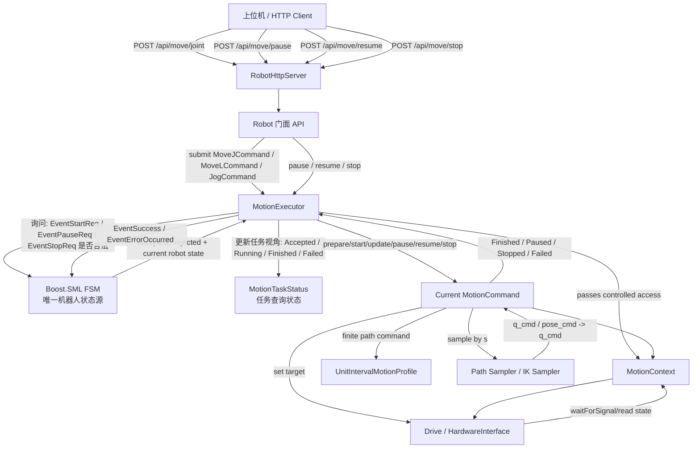

# Motion FSM, Executor, Command 技术设计

本文档整理机器人运动状态机与底层运动控制的解耦设计。目标是让 FSM 只负责状态流转，让 MoveJ、MoveL、点动等运动实现只负责运动细节，中间通过 MotionExecutor 和 MotionCommand 统一调度。

## 背景

当前 `Robot::MoveJ`、`Robot::MoveL`、点动、拖拽示教等接口直接调用 `enterRunning()` 和 `enterStopped()`。这种方式能工作，但运动函数会直接参与状态机流转，导致两个问题：

- 状态机知道的业务动作越来越多，后续 Pause、Resume、Stop、Servo、Identify 会继续增加耦合。
- 运动生命周期逻辑散落在不同函数里，容易出现失败路径没有释放 RUNNING、暂停继续语义不一致等问题。

新的设计希望形成如下边界：

```text
HTTP/API 层
  -> Robot 门面
  -> MotionExecutor
  -> FSM
  -> MotionCommand
  -> UnitIntervalMotionProfile / 底层控制循环
```

说明：`UnitIntervalMotionProfile` 已经提供 Start、Pause、Resume、Stop、Update 等能力，但当前主 `Robot::MoveJ/MoveL` 执行路径还没有完全接入它。本文档描述的是建议的目标架构和迁移顺序。

## 核心角色

### FSM

FSM 只管理机器人运动生命周期，不关心具体运动类型。

主要状态：

```text
STOPPED
STARTING
RUNNING
PAUSING
PAUSED
CONTINUING
STOPPING
ERROR_STATE
```

典型事件：

```text
EventStartReq
EventSuccess
EventPauseReq
EventContinueReq
EventStopReq
EventErrorOccurred
```

FSM 不应该知道 `MoveJ`、`MoveL`、`MoveC`、`Jog` 等具体名称。

## 逻辑框图



这张图表达三个关键隔离点：

- FSM 只接收事件，不调用 MoveJ/MoveL 细节。
- MotionExecutor 只调度当前 command，并使用 FSM 判断动作是否合法。
- MotionTaskStatus 只是任务查询状态，不替代 FSM 的机器人状态。
- MotionCommand 通过 MotionContext 访问底层资源，不直接拥有完整 `Robot` 控制权。

### MotionExecutor

MotionExecutor 是运动任务调度器，每个 `Robot` 建议持有一个 executor。

职责：

- 接收 `MotionCommand`。
- 检查当前是否已有运动任务。
- 请求 FSM 进入 STARTING/RUNNING。
- 启动运动线程或控制循环。
- 处理 pause、resume、stop。
- 接收 command 的 finished、failed、stopped 回报。
- 统一释放当前任务，并通知 FSM 回到 STOPPED 或进入 ERROR_STATE。

MotionExecutor 知道“当前有一个任务”，但不关心任务是 MoveJ 还是 MoveL。

FSM 是唯一的机器人运动状态源。MotionExecutor 不维护 `STOPPED/RUNNING/PAUSED` 这类机器人状态，避免出现两个状态源互相矛盾。Executor 只维护任务管理数据，例如当前 command、task id、任务查询状态、worker 线程状态和最后一次错误。

建议把 MotionExecutor 设计成“运动生命周期所有权”的唯一持有者：

```text
MotionExecutor
  owns current command
  owns/uses motion worker thread
  owns current task id / task state
  owns stop/pause/resume request coordination
  references FSM gateway
  references MotionContext
```

它内部可以维护如下任务状态和结果码：

```cpp
enum class MotionResultCode {
    Ok,
    Busy,
    InvalidCommand,
    InvalidState,
    Unsupported,
    PlanningFailed,
    ExecutionFailed,
    HardwareFault
};

enum class MotionTaskStatus {
    None,
    Accepted,
    Running,
    Paused,
    Stopping,
    Finished,
    Failed,
    Cancelled
};

enum class MotionStepStatus {
    Running,
    Paused,
    Finished,
    Stopped,
    Failed
};
```

`MotionTaskStatus` 只服务于 HTTP task 查询和 executor 清理逻辑，不参与机器人状态流转判断。判断“当前能不能 start/pause/resume/stop”必须问 FSM，而不是看 `MotionTaskStatus`。

例子：

```text
FSM = STOPPED, task_status = Finished
  -> 合法：机器人已停止，上一条任务完成。

FSM = ERROR_STATE, task_status = Failed
  -> 合法：机器人处于错误态，上一条任务失败。

FSM = RUNNING, task_status = Running
  -> 合法：当前任务正在占用机器人。
```

建议公开接口：

```cpp
class MotionExecutor {
public:
    MotionSubmitResult submit(std::unique_ptr<MotionCommand> command);

    MotionResult pause();
    MotionResult resume();
    MotionResult stop();

    MotionTaskStatus currentTaskStatus() const;
    std::string currentRobotState() const;
    bool hasActiveCommand() const;

private:
    void workerLoop();
    void finishCurrentCommand(MotionStepStatus status);
    MotionResult notifyStartAccepted();
    MotionResult notifyStopCompleted();
    MotionResult notifyError(MotionResultCode reason);
};
```

`submit()` 的责任边界：

```text
submit(command)
  -> command 非空检查
  -> current command 是否为空
  -> FSM 是否允许 EventStartReq
  -> command.prepare(ctx)
  -> command.start(ctx)
  -> 启动 workerLoop
  -> 返回 task_id 或错误
```

`pause()` 的责任边界：

```text
pause()
  -> 当前必须有 command
  -> 当前 command 必须 supportsPause()
  -> FSM 必须接受 EventPauseReq
  -> 调用 command.pause(ctx)
  -> workerLoop 继续 update，直到 command 返回 Paused
  -> FSM 接收 EventSuccess，进入 PAUSED
```

`resume()` 的责任边界：

```text
resume()
  -> 当前必须有 command
  -> 当前 command 必须 supportsResume()
  -> FSM 必须接受 EventContinueReq
  -> 调用 command.resume(ctx)
  -> FSM 接收 EventSuccess，进入 RUNNING
  -> workerLoop 继续 update
```

`stop()` 的责任边界：

```text
stop()
  -> 如果没有 command，可作为幂等 no-op
  -> 当前 command 必须 supportsStop()
  -> FSM 必须接受 EventStopReq
  -> 调用 command.stop(ctx)
  -> workerLoop 继续 update，直到 command 返回 Stopped
  -> 清理 command，FSM 进入 STOPPED
```

并发要求：

- `submit/pause/resume/stop` 可能来自 HTTP 线程。
- `workerLoop` 在运动线程或实时控制循环中运行。
- executor 对 `current_command_`、`task_status_`、请求标志必须加锁或使用原子状态。
- 不建议在持有 executor mutex 时调用可能阻塞的底层硬件函数。
- FSM 的 `process_event()` 已有递归锁保护，但 executor 仍应把自身状态保护好。

建议成员：

```cpp
class MotionExecutor {
private:
    mutable std::mutex mutex_;
    std::unique_ptr<MotionCommand> current_;
    MotionContext& ctx_;
    RobotFsmGateway& fsm_;
    std::unique_ptr<std::thread> worker_;
    std::atomic<bool> worker_running_{false};
    std::string current_task_id_;
    MotionTaskStatus task_status_;
    MotionResultCode last_result_{MotionResultCode::Ok};
    std::string last_error_message_;
};
```

`RobotFsmGateway` 可以是对现有 `Robot::Impl::process_event()` 的薄包装，避免 executor 直接依赖 Boost.SML 类型。

### MotionCommand

MotionCommand 是具体运动任务的抽象。

MotionCommand 的核心思想是：每个具体运动任务都实现同一套生命周期接口。MoveJ、MoveL、Jog 的差异只体现在 command 内部。

建议接口：

```cpp
class MotionCommand {
public:
    virtual ~MotionCommand() = default;

    virtual std::string name() const = 0;

    // 能力声明。Executor 根据这些能力决定是否允许发送 FSM pause/resume 事件。
    virtual bool supportsPause() const { return false; }
    virtual bool supportsResume() const { return false; }
    virtual bool supportsStop() const { return true; }

    // prepare 只做启动前检查和规划准备。失败通常不进入 ERROR_STATE。
    virtual MotionResult prepare(MotionContext& ctx) = 0;

    // start 激活内部控制器，例如 UnitIntervalMotionProfile::Start。
    virtual MotionResult start(MotionContext& ctx) = 0;

    // update 每个控制周期调用一次。返回任务当前进展。
    virtual MotionStepResult update(MotionContext& ctx) = 0;

    // pause/resume/stop 只改变 command 内部控制器状态，不直接操作 FSM。
    virtual MotionResult pause(MotionContext& ctx) {
        return MotionResult::Unsupported;
    }

    virtual MotionResult resume(MotionContext& ctx) {
        return MotionResult::Unsupported;
    }

    virtual MotionResult stop(MotionContext& ctx) = 0;
};
```

建议 `MotionStepResult` 携带错误信息：

```cpp
struct MotionStepResult {
    MotionStepStatus status;
    MotionResultCode code;
    std::string message;
};
```

Command 生命周期：

```text
Constructed
  -> prepare(ctx)
  -> start(ctx)
  -> update(ctx) repeated
  -> Finished / Paused / Stopped / Failed
```

有限路径 command 的典型内部结构：

```cpp
class MoveJCommand : public MotionCommand {
private:
    KDL::JntArray q_start_;
    KDL::JntArray q_goal_;
    KDL::JntArray q_cmd_;
    UnitIntervalMotionProfile profile_;
    bool stopping_{false};
    bool pausing_{false};
};
```

`MoveJCommand::update()` 的职责：

```text
profile.Update()
s = profile.position()
q_cmd = q_start + s * (q_goal - q_start)
ctx.setJointTargets(q_cmd)

if profile.HasError(): return Failed
if stopping && profile.IsStopCompleted(): return Stopped
if pausing && profile.IsStopped(): return Paused
if profile.HasReachedTarget(): return Finished
return Running
```

`MoveLCommand::update()` 的职责：

```text
profile.Update()
s = profile.position()
pose_cmd = sample Cartesian path by s
q_cmd = solve IK with q_last as seed
ctx.setJointTargets(q_cmd)

if IK failed during execution: return Failed or request safe stop
if stopping && profile.IsStopCompleted(): return Stopped
if pausing && profile.IsStopped(): return Paused
if profile.HasReachedTarget(): return Finished
return Running
```

`JogCommand` 的典型内部结构：

```cpp
class JogCommand : public MotionCommand {
public:
    bool supportsPause() const override { return false; }
    bool supportsResume() const override { return false; }
    bool supportsStop() const override { return true; }

private:
    JogDirection direction_;
    double velocity_;
    bool stopping_{false};
};
```

`JogCommand::update()` 的职责：

```text
if not stopping:
    compute next jog target or velocity command
    ctx.setJointTargets(...) or ctx.setJointVelocities(...)
    return Running

if stopping:
    ramp velocity down
    if velocity reaches 0: return Stopped
    return Running
```

Command 的禁止事项：

- 不直接调用 FSM `process_event()`。
- 不直接调用 `enterRunning()` / `enterStopped()`。
- 不直接持有完整 `Robot*`，除非处于迁移阶段。
- 不在 `prepare()` 里启动不可回滚的硬件运动。

典型子类：

```text
MoveJCommand
MoveLCommand
MoveCCommand
MovePCommand
JogCommand
AdmittanceTeachCommand
IdentifyCommand
```

### MotionContext

MotionContext 是 command 访问机器人底层资源的受控上下文，避免 command 到处持有完整 `Robot*`。

可能包含：

```text
joint count
joint current position/velocity
joint mode
joint limits
kinematics solver
hardware waitForSignal
set joint target position/velocity
logger
stop token / cancellation token
```

实现初期可以先用轻量包装，内部仍转发到 `Robot`，后续再逐步收窄权限。

建议 MotionContext 分成只读状态、规划服务、控制输出、同步等待四类能力。

```cpp
class MotionContext {
public:
    // 只读状态
    int jointCount() const;
    std::vector<double> jointPositions() const;
    std::vector<double> jointVelocities() const;
    ModeOfOperation jointMode(int id) const;
    bool isEnabled() const;
    KDL::Frame flangePose() const;

    // 限制与配置
    std::vector<double> maxJointVelocity() const;
    std::vector<double> maxJointAcceleration() const;
    std::vector<double> maxJointJerk() const;
    double controlPeriod() const;

    // 规划服务
    bool solveIk(const KDL::Frame& pose,
                 const KDL::JntArray& seed,
                 KDL::JntArray& q_out);
    bool forwardKinematics(const KDL::JntArray& q,
                           KDL::Frame& pose_out);

    // 控制输出
    void setJointPosition(int id, double position);
    void setJointVelocity(int id, double velocity);
    void setJointTargets(const KDL::JntArray& q);
    void setJointVelocities(const KDL::JntArray& dq);

    // 控制同步
    void waitControlCycle();

    // 日志与错误
    Logger::logger_ptr logger();
};
```

MotionContext 的价值：

- 限制 command 能访问的范围，避免 command 依赖 `Robot` 的全部内部字段。
- 让 MoveJCommand、MoveLCommand 可以单独测试。
- 后续替换硬件、仿真或离线测试时，只需要替换 context。
- 让 executor 可以统一注入 cancel token、pause token、task id、logger。

迁移阶段可以先这样实现：

```cpp
class RobotMotionContext : public MotionContext {
public:
    explicit RobotMotionContext(Robot& robot);

private:
    Robot& robot_;
};
```

但应把 `RobotMotionContext` 作为唯一持有 `Robot&` 的适配层，command 不直接接触 `Robot&`。

线程安全建议：

- `jointPositions()`、`flangePose()` 等读取应复用现有 `Robot::mtx` 或新增清晰的状态锁。
- `setJointTargets()` 应只在运动控制线程调用。
- `waitControlCycle()` 应封装 `hw_interface_->waitForSignal(0)`。
- `isEnabled()` 可以作为 command 每周期安全检查，硬件异常由 executor 转成 `ERROR_STATE`。

MotionContext 与现有代码的对应关系：

```text
ctx.jointPositions()
  -> Robot::pos_

ctx.jointMode(id)
  -> joints_[id]->getMode()

ctx.setJointPosition(id, q)
  -> joints_[id]->setPosition(q)

ctx.setJointVelocity(id, dq)
  -> joints_[id]->setVelocity(dq)

ctx.waitControlCycle()
  -> hw_interface_->waitForSignal(0)

ctx.solveIk(...)
  -> kinematics_.CartToJnt(...)
```

### UnitIntervalMotionProfile

`UnitIntervalMotionProfile` 是一维单位区间进度规划器。它不表示 MoveJ 或 MoveL，而是表示路径进度 `s`。

```text
s = position()      当前路径进度，范围 0 到 1
s_dot = velocity()  路径进度速度
s_ddot = acceleration()
```

行为：

- `Start()`：从 `s = 0` 规划到 `s = 1`。
- `Pause()`：从当前 `s_dot` 平滑减速到 0，保留当前 `s`。
- `Resume()`：从当前 `s` 继续规划到 `s = 1`。
- `Stop()`：从当前 `s_dot` 平滑减速到 0，并标记 stop completed。
- `Update()`：每个控制周期推进一次。

它适合作为 MoveJ、MoveL、MoveC 等有限路径运动的共用进度控制器。

## Sampler 的含义

Sampler 是将 `s` 映射到底层控制目标的组件。它可以是独立类，也可以只是 command 内部函数。

### MoveJ Sampler

MoveJ 在关节空间插值：

```text
q_cmd = q_start + s * (q_goal - q_start)
qdot_cmd = s_dot * (q_goal - q_start)
qddot_cmd = s_ddot * (q_goal - q_start)
```

### CartesianPathSampler

CartesianPathSampler 表示笛卡尔路径采样。

MoveL 示例：

```text
p_cmd = p_start + s * (p_goal - p_start)
R_cmd = slerp(R_start, R_goal, s)
```

MoveC 示例：

```text
pose_cmd = sample circle arc by s
```

### IKSampler

IKSampler 表示从笛卡尔位姿求关节目标：

```text
q_cmd = IK(pose_cmd, q_seed)
```

MoveL 可以先实现成一个合并版 `MoveLSampler`，内部同时做笛卡尔采样和 IK：

```text
s -> pose_cmd -> q_cmd
```

不要求一开始就拆成多个类。

## 能力声明

不是所有 command 都支持 pause/resume。

MoveJ、MoveL、MoveC 这类有限路径运动通常支持：

```text
supportsPause() = true
supportsResume() = true
supportsStop() = true
```

连续点动通常只支持 stop：

```text
supportsPause() = false
supportsResume() = false
supportsStop() = true
```

Executor 必须先检查 command 能力，再触发 FSM 事件。

错误示例：

```text
先 RUNNING -> PAUSING，再发现 Jog 不支持 pause
```

正确示例：

```text
pause request
  -> executor checks current_command.supportsPause()
  -> unsupported
  -> 不触发 EventPauseReq
  -> FSM 保持 RUNNING
  -> API 返回当前任务不支持暂停
```

## 统一状态流转

### 提交运动任务

```text
submit(command)
  -> if command is null: return InvalidCommand
  -> if current command exists: return Busy
  -> if FSM cannot process EventStartReq: return InvalidState / Busy
  -> FSM: STOPPED -> STARTING
  -> command.prepare()
  -> if prepare failed: EventStopReq or EventErrorOccurred
  -> command.start()
  -> FSM: STARTING -> RUNNING
  -> executor control loop calls command.update()
```

### 控制周期

```text
while command active:
  result = command.update(ctx)

  if result == Running:
      hw.waitForSignal(0)

  if result == Finished:
      FSM: RUNNING -> STOPPING -> STOPPED
      clear current command

  if result == Stopped:
      FSM: STOPPING -> STOPPED
      clear current command

  if result == Failed:
      FSM: * -> ERROR_STATE
      clear current command
```

### 暂停

```text
pause()
  -> require current command
  -> require current command supports pause
  -> require FSM accepts EventPauseReq
  -> FSM: RUNNING -> PAUSING
  -> command.pause()
  -> control loop continues updating until command reports Paused
  -> FSM: PAUSING -> PAUSED
```

暂停不是立刻停止线程。控制循环应继续运行，直到底层控制器平滑减速到 0。

### 继续

```text
resume()
  -> require current command
  -> require current command supports resume
  -> require FSM accepts EventContinueReq
  -> FSM: PAUSED -> CONTINUING
  -> command.resume()
  -> FSM: CONTINUING -> RUNNING
  -> control loop continues updating
```

### 停止

```text
stop()
  -> require current command
  -> require current command supports stop
  -> require FSM accepts EventStopReq
  -> FSM: RUNNING/PAUSED -> STOPPING
  -> command.stop()
  -> control loop continues updating until command reports Stopped
  -> FSM: STOPPING -> STOPPED
  -> clear current command
```

## 示例运行逻辑

### 场景 1：MoveJ 正常完成

```text
上位机 POST /api/move/joint
  -> RobotHttpServer parses q, speed, acceleration, radius
  -> Robot::MoveJ creates MoveJCommand
  -> MotionExecutor::submit(MoveJCommand)
  -> FSM: STOPPED -> STARTING
  -> MoveJCommand.prepare()
       - check joint count
       - check joint mode
       - check target limits
       - save q_start and q_goal
       - compute profile limits from joint limits
  -> MoveJCommand.start()
       - profile.Reset()
       - profile.Start(max_s_dot, max_s_ddot, max_s_jerk)
  -> FSM: STARTING -> RUNNING
  -> control loop:
       - profile.Update()
       - s = profile.position()
       - q_cmd = q_start + s * (q_goal - q_start)
       - joints[i].setPosition(q_cmd[i])
       - waitForSignal(0)
  -> profile.HasReachedTarget()
  -> command reports Finished
  -> FSM: RUNNING -> STOPPING -> STOPPED
  -> task finished
```

### 场景 2：MoveL 正常完成

```text
上位机 POST /api/move/linear
  -> RobotHttpServer parses target pose
  -> Robot::MoveL creates MoveLCommand
  -> MotionExecutor::submit(MoveLCommand)
  -> FSM: STOPPED -> STARTING
  -> MoveLCommand.prepare()
       - check joint mode
       - save current pose as p_start/R_start
       - save target pose as p_goal/R_goal
       - compute path length and rotation angle
       - compute unit interval profile limits
  -> MoveLCommand.start()
       - profile.Reset()
       - profile.Start(...)
  -> FSM: STARTING -> RUNNING
  -> control loop:
       - profile.Update()
       - s = profile.position()
       - pose_cmd = sample linear position and slerp rotation
       - q_cmd = IK(pose_cmd, q_last)
       - joints[i].setPosition(q_cmd[i])
       - q_last = q_cmd
       - waitForSignal(0)
  -> profile.HasReachedTarget()
  -> FSM: RUNNING -> STOPPING -> STOPPED
  -> task finished
```

### 场景 3：MoveJ 运行中暂停

```text
当前 FSM = RUNNING
current command = MoveJCommand

上位机 POST /api/move/pause
  -> MotionExecutor::pause()
  -> MoveJCommand.supportsPause() == true
  -> FSM: RUNNING -> PAUSING
  -> MoveJCommand.pause()
       - profile.Pause()
  -> control loop continues:
       - profile.Update()
       - q_cmd = q_start + s * delta_q
       - setPosition(q_cmd)
       - waitForSignal(0)
  -> profile.IsStopped() == true
  -> command reports Paused
  -> FSM: PAUSING -> PAUSED
```

### 场景 4：MoveJ 暂停后继续

```text
当前 FSM = PAUSED
current command = MoveJCommand
profile.position() = s_pause

上位机 POST /api/move/resume
  -> MotionExecutor::resume()
  -> MoveJCommand.supportsResume() == true
  -> FSM: PAUSED -> CONTINUING
  -> MoveJCommand.resume()
       - profile.Resume()
  -> FSM: CONTINUING -> RUNNING
  -> control loop:
       - profile.Update()
       - s 从 s_pause 继续到 1
       - q_cmd = q_start + s * delta_q
  -> finished
  -> FSM: RUNNING -> STOPPING -> STOPPED
```

### 场景 5：MoveL 运行中暂停并继续

```text
当前 FSM = RUNNING
current command = MoveLCommand

pause:
  -> supportsPause() == true
  -> FSM: RUNNING -> PAUSING
  -> profile.Pause()
  -> control loop keeps sampling pose by current s
  -> IK continues with q_last seed
  -> profile.IsStopped()
  -> FSM: PAUSING -> PAUSED

resume:
  -> supportsResume() == true
  -> FSM: PAUSED -> CONTINUING
  -> profile.Resume()
  -> FSM: CONTINUING -> RUNNING
  -> s continues to 1
  -> pose_cmd continues along same Cartesian path
  -> finished
  -> FSM: RUNNING -> STOPPING -> STOPPED
```

### 场景 6：MoveJ 运行中停止

```text
当前 FSM = RUNNING
current command = MoveJCommand

上位机 POST /api/move/stop
  -> MotionExecutor::stop()
  -> MoveJCommand.supportsStop() == true
  -> FSM: RUNNING -> STOPPING
  -> MoveJCommand.stop()
       - profile.Stop()
  -> control loop continues:
       - profile.Update()
       - q_cmd follows deceleration
  -> profile.IsStopCompleted()
  -> command reports Stopped
  -> FSM: STOPPING -> STOPPED
```

### 场景 7：MoveJ 暂停后停止

```text
当前 FSM = PAUSED
current command = MoveJCommand
profile.IsStopped() == true

上位机 POST /api/move/stop
  -> MotionExecutor::stop()
  -> FSM: PAUSED -> STOPPING
  -> MoveJCommand.stop()
       - profile.Stop()
       - because profile is already stopped, stop completes immediately
  -> command reports Stopped
  -> FSM: STOPPING -> STOPPED
```

### 场景 8：点动正常启动

连续点动没有固定终点，因此不建议强行使用 `UnitIntervalMotionProfile` 的 `0 -> 1` 模型。

```text
上位机 POST /api/jog/start
  -> Robot creates JogCommand(direction, velocity)
  -> MotionExecutor::submit(JogCommand)
  -> FSM: STOPPED -> STARTING
  -> JogCommand.prepare()
       - check joint mode
       - check velocity limits
       - save jog direction and velocity
  -> JogCommand.start()
  -> FSM: STARTING -> RUNNING
  -> control loop:
       - compute next q_cmd or velocity command
       - setPosition/setVelocity
       - waitForSignal(0)
  -> keeps running until stop request
```

### 场景 9：点动时暂停无效

```text
当前 FSM = RUNNING
current command = JogCommand

上位机 POST /api/move/pause
  -> MotionExecutor::pause()
  -> JogCommand.supportsPause() == false
  -> return Unsupported
  -> FSM remains RUNNING
  -> JogCommand keeps jogging
  -> API returns: current motion type does not support pause
```

关键点：不触发 `EventPauseReq`。

### 场景 10：点动时继续无效

```text
当前 FSM = RUNNING
current command = JogCommand

上位机 POST /api/move/resume
  -> MotionExecutor::resume()
  -> JogCommand.supportsResume() == false
  -> return Unsupported
  -> FSM remains RUNNING
  -> API returns: current motion type does not support resume
```

如果当前不是 PAUSED，resume 本身也应返回 InvalidState。

### 场景 11：点动停止

```text
当前 FSM = RUNNING
current command = JogCommand

上位机 POST /api/move/stop
  -> MotionExecutor::stop()
  -> JogCommand.supportsStop() == true
  -> FSM: RUNNING -> STOPPING
  -> JogCommand.stop()
       - start velocity ramp down
  -> control loop continues until velocity reaches 0
  -> command reports Stopped
  -> FSM: STOPPING -> STOPPED
```

### 场景 12：相对距离点动

如果点动接口是“移动固定相对距离”，例如关节 +0.01 rad，则它本质上是小型 MoveJ，可以复用 `UnitIntervalMotionProfile`。

```text
上位机 POST /api/jog/step
  -> q_goal = q_current + delta
  -> create StepJogCommand
  -> StepJogCommand uses UnitIntervalMotionProfile
  -> supportsPause/resume can be true or false, based on product semantics
  -> if treated as finite motion:
       STOPPED -> STARTING -> RUNNING -> STOPPING -> STOPPED
```

### 场景 13：运行中再次提交 MoveJ

```text
当前 FSM = RUNNING
current command = MoveLCommand

上位机 POST /api/move/joint
  -> Robot creates MoveJCommand
  -> MotionExecutor::submit(MoveJCommand)
  -> FSM refuses EventStartReq or executor detects current command exists
  -> return Busy
  -> FSM remains RUNNING
  -> current MoveL continues
```

### 场景 14：规划失败

规划失败通常不应进入 `ERROR_STATE`，因为它是命令参数或路径不可达问题，不是机器人硬件错误。

```text
上位机 POST /api/move/linear
  -> submit MoveLCommand
  -> FSM: STOPPED -> STARTING
  -> MoveLCommand.prepare()
       - IK failed / path invalid / limits invalid
  -> executor treats prepare failed as command rejected
  -> FSM: STARTING -> STOPPING -> STOPPED
  -> clear command
  -> API/task returns planning failed
```

### 场景 15：执行中 IK 失败

执行中 IK 失败比 prepare 阶段更严重，因为机器人已经开始运动。

```text
当前 FSM = RUNNING
current command = MoveLCommand

control loop:
  -> sample pose by s
  -> IK failed
  -> command reports Failed
  -> executor requests safe stop if possible
  -> if safe stop succeeds:
       FSM: RUNNING -> STOPPING -> STOPPED
  -> if unsafe/hardware abnormal:
       FSM: RUNNING -> ERROR_STATE
```

建议实现中区分：

```text
RecoverableFailure: safe stop then STOPPED
FatalFailure: ERROR_STATE
```

### 场景 16：执行中驱动掉使能

```text
当前 FSM = RUNNING

control loop detects !IsEnabled()
  -> command reports Failed or HardwareFault
  -> executor sends EventErrorOccurred
  -> FSM: RUNNING -> ERROR_STATE
  -> require reset / enable before next motion
```

硬件掉使能、急停、通信错误应进入 `ERROR_STATE`。

### 场景 17：暂停期间驱动掉使能

```text
当前 FSM = PAUSED

monitor detects !IsEnabled()
  -> executor sends EventErrorOccurred
  -> FSM: PAUSED -> ERROR_STATE
  -> current command invalidated
```

### 场景 18：无任务时 Stop

```text
当前 FSM = STOPPED
current command = null

上位机 POST /api/move/stop
  -> MotionExecutor::stop()
  -> no active command
  -> return NoActiveCommand or success no-op
  -> FSM remains STOPPED
```

建议 HTTP 层把 stop 设计为幂等操作：无运动时返回 success/no-op。

### 场景 19：无任务时 Pause

```text
当前 FSM = STOPPED
current command = null

上位机 POST /api/move/pause
  -> MotionExecutor::pause()
  -> return NoActiveCommand
  -> FSM remains STOPPED
```

### 场景 20：无任务时 Resume

```text
当前 FSM = STOPPED
current command = null

上位机 POST /api/move/resume
  -> MotionExecutor::resume()
  -> return NoActiveCommand or InvalidState
  -> FSM remains STOPPED
```

### 场景 21：ERROR_STATE 下提交运动

```text
当前 FSM = ERROR_STATE

上位机 POST /api/move/joint
  -> MotionExecutor::submit()
  -> FSM refuses EventStartReq
  -> return InvalidState
  -> require reset/enable first
```

### 场景 22：初始化后未使能提交运动

```text
当前 FSM = IDLE

上位机 POST /api/move/joint
  -> MotionExecutor::submit()
  -> FSM refuses EventStartReq
  -> return NotEnabled / InvalidState
  -> 上位机应先 POST /api/robot/enable
```

### 场景 23：使能成功后提交运动

```text
当前 FSM = IDLE

上位机 POST /api/robot/enable
  -> FSM: IDLE -> ENABLING
  -> Robot setEnabled()
  -> IsEnabled()
  -> FSM: ENABLING -> STOPPED

上位机 POST /api/move/joint
  -> normal submit
```

## API 建议

新增或整理如下控制接口：

```text
POST /api/move/pause
POST /api/move/resume
POST /api/move/stop
GET  /api/move/status?task_id=...
```

返回建议：

```text
0    success
200x planning/execution error
300x robot state error
500x async task error
```

对点动 pause/resume：

```json
{
  "success": false,
  "code": 3004,
  "message": "Current motion type does not support pause"
}
```

## 实现迁移建议

### 阶段 1：建立边界

- 新增 `MotionCommand`、`MotionExecutor`、`MotionContext`。
- 保留现有 `Robot::MoveJ/MoveL` 公开 API。
- 让 `Robot::MoveJ/MoveL` 创建 command 并提交 executor。
- 暂时可以让 command 内部复用现有规划/执行代码。

### 阶段 2：接入 UnitIntervalMotionProfile

- 将 MoveJ 改为 `UnitIntervalMotionProfile + JointSampler`。
- 将 MoveL 改为 `UnitIntervalMotionProfile + MoveLSampler`。
- 暂停/继续/停止统一由 profile 完成。

### 阶段 3：点动和拖拽示教 command 化

- 点动使用 `JogCommand`，不支持 pause/resume。
- 拖拽示教使用 `AdmittanceTeachCommand`，按语义决定是否支持 pause/resume。
- 所有运动占用都走 executor，不再直接调用 `enterRunning()/enterStopped()`。

### 阶段 4：收敛状态机事件

- `enterRunning()`、`enterStopped()` 从公开运动函数中移除。
- FSM 事件只由 executor 发出。
- `Robot` 对外仍保留兼容 API。

## 设计原则

- FSM 只管状态，不管轨迹。
- Executor 只管生命周期，不管轨迹细节。
- Command 只管具体运动，不直接改 FSM。
- UnitIntervalMotionProfile 只管路径进度，不知道机器人状态。
- Pause/Resume 能力由 command 声明，executor 统一拦截。
- Stop 尽量幂等，并优先平滑停止。
- 参数错误和规划失败默认不进入 `ERROR_STATE`。
- 硬件错误、通信错误、驱动掉使能进入 `ERROR_STATE`。
